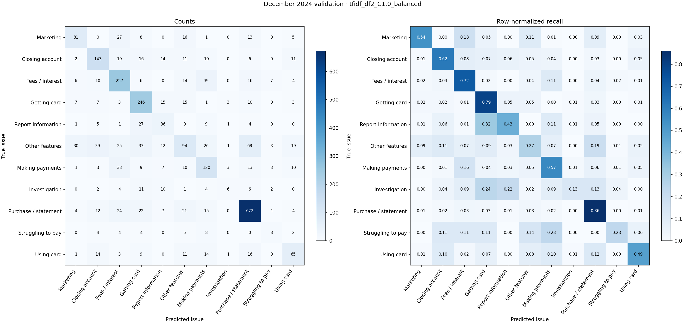

# First narrative-only validation benchmark

The frozen cohort, labels, duplicate policy, and temporal splits are unchanged. Only cohort/train.csv (2,424 November 2024 records) and cohort/validation.csv (2,695 December 2024 records) were read for experiments. The 2025 test set was not opened, hashed, inspected, or scored. All learned vocabulary, IDF, coefficients, class weights, and fallback frequencies use training only. Models have not been refit on training plus validation.

## Validation results

| experiment | macro_f1 | weighted_f1 | accuracy | balanced_accuracy | feature_dim | fit_seconds |
| --- | --- | --- | --- | --- | --- | --- |
| majority | 0.0409 | 0.1305 | 0.2902 | 0.0909 | 0 | 0.0000 |
| lexical | 0.2842 | 0.3831 | 0.4289 | 0.2848 | 67 | 0.0000 |
| tfidf_df1_C1.0_none | 0.2933 | 0.4658 | 0.5410 | 0.2987 | 138947 | 12.4003 |
| tfidf_df1_C1.0_balanced | 0.4998 | 0.6210 | 0.6386 | 0.4981 | 138947 | 12.0858 |
| tfidf_df1_C4.0_none | 0.4075 | 0.5619 | 0.6045 | 0.3913 | 138947 | 23.9696 |
| tfidf_df1_C4.0_balanced | 0.4847 | 0.6246 | 0.6427 | 0.4746 | 138947 | 16.7009 |
| tfidf_df2_C1.0_none | 0.3125 | 0.4900 | 0.5592 | 0.3169 | 50174 | 6.4886 |
| tfidf_df2_C1.0_balanced | 0.5111 | 0.6279 | 0.6412 | 0.5117 | 50174 | 4.7399 |
| tfidf_df2_C4.0_none | 0.4171 | 0.5724 | 0.6100 | 0.4006 | 50174 | 9.4362 |
| tfidf_df2_C4.0_balanced | 0.5020 | 0.6314 | 0.6453 | 0.4892 | 50174 | 7.7530 |

Selected TF-IDF/logistic-regression configuration: **tfidf_df2_C1.0_balanced**, using validation macro-F1. Feature dimensionality: **50,174**. Selection is among eight explicit configurations, not a random search or cross-validation search. All solver convergence warnings are recorded in validation_results.json.

## Selected model: per-label validation metrics

| Issue | precision | recall | f1 | support |
| --- | --- | --- | --- | --- |
| Advertising and marketing, including promotional offers | 0.6090 | 0.5364 | 0.5704 | 151 |
| Closing your account | 0.5983 | 0.6164 | 0.6072 | 232 |
| Fees or interest | 0.6425 | 0.7159 | 0.6772 | 359 |
| Getting a credit card | 0.6292 | 0.7935 | 0.7019 | 310 |
| Incorrect information on your report | 0.3564 | 0.4286 | 0.3892 | 84 |
| Other features, terms, or problems | 0.4747 | 0.2686 | 0.3431 | 350 |
| Problem when making payments | 0.4858 | 0.5660 | 0.5229 | 212 |
| Problem with a company's investigation into an existing problem | 0.4000 | 0.1304 | 0.1967 | 46 |
| Problem with a purchase shown on your statement | 0.8155 | 0.8593 | 0.8369 | 782 |
| Struggling to pay your bill | 0.3333 | 0.2286 | 0.2712 | 35 |
| Trouble using your card | 0.5285 | 0.4851 | 0.5058 | 134 |

## Validation confusion matrix

Rows are true labels; columns are predictions. Full-label count matrices and per-label reports are saved for every baseline/configuration. The companion panel normalizes within each true label.

## Methods

Majority predicts the most frequent November training label for every record. The fixed lexical baseline counts distinct phrase cues per class; ties and no-match cases fall back to training label frequencies. Cues were saved before evaluation, contain no company names, and were not revised using validation scores. This is a transparent heuristic, not a semantic representation; it can mishandle negation, multi-issue narratives, paraphrases, and overlapping cues. See experiment_config.json and lexical_validation_evidence.csv.

TF-IDF uses word-level unigrams/bigrams with punctuation emitted as individual tokens, numbers including comma/decimal groups retained, and apostrophes retained within contractions. Lowercasing is the sole fixed text transformation. There is no stop-word list, stemming, lemmatization, truncation, redaction-token removal, or numeric masking. min_df=1 keeps every training token/ngram; min_df=2 excludes singleton-document features as an explicit validated option. No max_df filtering or feature cap is used. Sublinear term frequency, smoothed IDF, and L2 normalization are fixed. Unseen validation features contribute zero; validation never updates vocabulary or IDF.

Logistic regression uses joint multinomial softmax with L2 penalty and lbfgs. The eight settings vary min_df∈{1,2}, C∈{1,4}, and class_weight∈{None,balanced}; balancing uses November frequencies. Maximum iterations=1000, tolerance=1e-4, random seed=20261008. No embeddings or transformers are used. [scikit-learn logistic-regression documentation](https://scikit-learn.org/1.7/modules/generated/sklearn.linear_model.LogisticRegression.html), [TF-IDF documentation](https://scikit-learn.org/1.7/modules/generated/sklearn.feature_extraction.text.TfidfVectorizer.html).

## Strongest positive lexical features

These are the largest positive class coefficients, not causal effects or per-record contributions. Correlated features and class balancing affect their interpretation. Training document and class-document counts accompany the top 25 per class in selected_positive_features.csv; all eight models are in positive_features_all_models.csv. No suspicious feature has been removed.

| Issue | Top 10 positive features |
| --- | --- |
| Advertising and marketing, including promotional offers | offer; promotion; bonus; promotional; misleading; advertised; approved; the offer; offer .; terms |
| Closing your account | closed; closed my; close; account; to close; my account; closure; was closed; account was; close my |
| Fees or interest | interest; fee; fees; charged; late; late fee; the interest; late fees; charge; rate |
| Getting a credit card | application; applied for; opened; my name; applied; name; report; open; credit; knowledge |
| Incorrect information on your report | report; credit report; reported; on my; off; my credit; 1099; removed; this account; late |
| Other features, terms, or problems | rewards; points; check; issue; transfer; reward; the rewards; cash; my rewards; rewards . |
| Problem when making payments | payment; payments; a payment; the payment; to make; make; my payment; pay; to pay; my bank |
| Problem with a company's investigation into an existing problem | reporting; 1666 b; understand; my report; late; usc 1666; late payment; as late; information; yet to |
| Problem with a purchase shown on your statement | dispute; charges; charge; merchant; the merchant; refund; the dispute; fraudulent; the charge; transaction |
| Struggling to pay your bill | hardship; settlement; financial; financial hardship; plan; to negotiate; payment plan; negotiate; declared disaster; disaster |
| Trouble using your card | limit; credit limit; blocked; card; use; declined; my card; locked; to use; the card |

## Runtime and reproducibility

Wall time for the benchmark including evaluation, serialization, feature export, and plotting: 124.68 seconds. Per-model fit and prediction times, vectorizer fit/transform times, solver iterations, matrix nonzeros, and dimensions are saved in validation_results.json. Shared vectorization times are reported on each configuration and should not be summed repeatedly. One BLAS/OpenMP thread was used. Fit time excludes TF-IDF fitting. Majority/lexical fit time is zero because only training frequency counting is needed; that common setup is included in total runtime.

experiment_config.json saves every setting and phrase cue. run_manifest.json saves source/data hashes, package/runtime versions, class counts, and validation-only access declarations. All fitted pipelines are saved as joblib artifacts; selected_pipeline.joblib remains trained only on November. CSV predictions allow metrics to be recomputed without fitting. requirements-lock.txt pins numerical/runtime dependencies. Re-run with .venv-benchmark/Scripts/python.exe run_validation_benchmark.py. Only load joblib artifacts from trusted sources.

Validation has been used to choose a configuration, so its scores are development estimates. Minority labels have small support; do not interpret small score differences as established gains. Any later feature-removal or cleaning experiment requires review. Test evaluation remains pending approval.

## Reviewed diagnostic findings

See [diagnostics.md](diagnostics.md) for class-by-class shortcut/leakage observations and validation confusions, and shortcut_training_contexts.csv for short training-only contexts. Reproduce this review artifact with inspect_validation_diagnostics.py; it never fits or changes a model.
