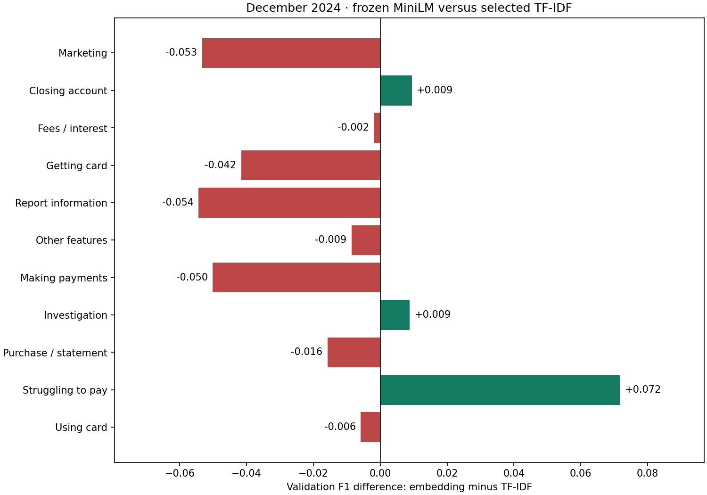

# Frozen sentence-embedding validation benchmark

The approved cohort, 11 labels, duplicate handling, and temporal splits are unchanged. November 2024 is the sole classifier-fitting set; December 2024 chooses among four predeclared classifier configurations. No 2025 test data was opened, hashed, inspected, encoded, or scored. Existing TF-IDF artifacts and environment are unchanged.

## Selected model comparison

| representation | configuration | macro_f1 | weighted_f1 | accuracy | balanced_accuracy | dimension | classifier_fit_seconds |
| --- | --- | --- | --- | --- | --- | --- | --- |
| selected TF-IDF | tfidf_df2_C1.0_balanced | 0.5111 | 0.6279 | 0.6412 | 0.5117 | 50174 | 4.7399 |
| frozen MiniLM chunk aggregate | embedding_C4.0_balanced | 0.4983 | 0.6101 | 0.6037 | 0.5337 | 384 | 0.1695 |

## Per-label F1 comparison

| Issue | f1_tfidf | f1_embedding | f1_difference_embedding_minus_tfidf | support_embedding |
| --- | --- | --- | --- | --- |
| Advertising and marketing, including promotional offers | 0.5704 | 0.5171 | -0.0533 | 151 |
| Closing your account | 0.6072 | 0.6167 | +0.0094 | 232 |
| Fees or interest | 0.6772 | 0.6754 | -0.0018 | 359 |
| Getting a credit card | 0.7019 | 0.6603 | -0.0416 | 310 |
| Incorrect information on your report | 0.3892 | 0.3348 | -0.0543 | 84 |
| Other features, terms, or problems | 0.3431 | 0.3345 | -0.0086 | 350 |
| Problem when making payments | 0.5229 | 0.4727 | -0.0501 | 212 |
| Problem with a company's investigation into an existing problem | 0.1967 | 0.2055 | +0.0088 | 46 |
| Problem with a purchase shown on your statement | 0.8369 | 0.8211 | -0.0158 | 782 |
| Struggling to pay your bill | 0.2712 | 0.3429 | +0.0717 | 35 |
| Trouble using your card | 0.5058 | 0.5000 | -0.0058 | 134 |

per_label_comparison.csv also contains both models’ precision, recall, F1, and support. Every embedding classifier has its own full per-label report, validation predictions, confusion matrix, and fitted artifact. Comparisons use the same 2,695 validation narratives, with no record removal.

## All four frozen-embedding classifier choices

| id | C | class_weight | macro_f1 | weighted_f1 | accuracy | balanced_accuracy | embedding_dimension | fit_seconds | predict_seconds | iterations | converged |
| --- | --- | --- | --- | --- | --- | --- | --- | --- | --- | --- | --- |
| embedding_C1.0_none | 1.0 | nan | 0.4639234672029767 | 0.5984657745043286 | 0.624860853432282 | 0.4427582772177553 | 384 | 0.17356149991974235 | 0.0040194999892264605 | 58 | True |
| embedding_C1.0_balanced | 1.0 | balanced | 0.49410735554803525 | 0.6091642761518073 | 0.6063079777365492 | 0.5394618978291738 | 384 | 0.12523139989934862 | 0.003531700000166893 | 45 | True |
| embedding_C4.0_none | 4.0 | nan | 0.48655416688273495 | 0.6055168518632662 | 0.6211502782931354 | 0.4670095068268262 | 384 | 0.228669400094077 | 0.003567799925804138 | 89 | True |
| embedding_C4.0_balanced | 4.0 | balanced | 0.49826730660970636 | 0.6101165539540906 | 0.6037105751391466 | 0.5336974357991496 | 384 | 0.1695367000065744 | 0.0038904999382793903 | 66 | True |

## Encoding and long-narrative handling

| split | tokenize_and_chunk_seconds | transformer_inference_seconds | aggregate_seconds | encode_total_seconds | narratives | affected_narratives | chunks | content_wordpieces | max_content_wordpieces | max_chunks_per_narrative |
| --- | --- | --- | --- | --- | --- | --- | --- | --- | --- | --- |
| train | 1.033385599963367 | 89.19291560002603 | 0.04637180012650788 | 90.27267639990896 | 2424 | 958 | 3949 | 676092 | 7686 | 31 |
| validation | 1.1577355000190437 | 108.55656099994667 | 0.05849849991500378 | 109.77279630000703 | 2695 | 1075 | 4376 | 753336 | 3997 | 16 |

The pretrained all-MiniLM-L6-v2 model yields 384-dimensional vectors and defaults to a 256-wordpiece input limit. We honor that limit including the two special tokens: each chunk has at most 254 original content wordpieces. Entire narratives are tokenized without truncation, split contiguously with zero overlap, and passed directly as token IDs to the pretrained SentenceTransformer modules. Every content token is covered exactly once; no decode/re-tokenize round trip is used.

Each chunk uses the pretrained pooling/normalization; its vector is L2-normalized. Narrative vectors are the content-token-count-weighted mean of the chunk vectors, then L2-normalized. Even long narratives yield one fixed 384-dimensional vector. There is no learned pooling or validation-selected chunk policy. This preserves token coverage but loses cross-chunk context and mixes potentially distinct issues; it is a document-level extension of a short-paragraph model, not the encoder’s native long-context capability. narrative_length_audit.csv lists token lengths, chunk counts, and coverage by ID for training/validation only.

[Official model card](https://huggingface.co/sentence-transformers/all-MiniLM-L6-v2) documents the embedding size and default truncation limit.

## Frozen training and reproducibility

Pretrained repository: sentence-transformers/all-MiniLM-L6-v2; immutable revision: 1110a243fdf4706b3f48f1d95db1a4f5529b4d41. Encoder loading took 0.19s. Whole benchmark runtime was 203.82s, excluding dependency installation/model download. Encoding times include tokenization/chunk preparation, transformer inference, and aggregation; classifier times exclude encoding.

CPU float32 encoder inference uses torch.inference_mode(), eval mode, requires_grad=False, four CPU threads, deterministic algorithms, and seed 20261008. State hashes before/after encoding match; no transformer parameter receives a gradient. No fine-tuning is performed. The model and tokenizer are loaded offline from locally downloaded pinned artifacts; narratives never leave the machine.

Classifier inputs are only the frozen narrative vectors. No standardization, PCA, or additional learned preprocessing is used. Multinomial logistic regression uses lbfgs, L2 penalty, C∈{1,4}, class_weight∈{None,balanced}, max_iter=1000, tol=1e-4, and one BLAS thread. Balanced weights use November label counts only. Highest December macro-F1 selects the configuration, with listed order as an exact-tie fallback. No broad search, encoder comparison, or embedding-policy tuning was performed.

run_manifest.json records runtime/package versions, input/source/model/embedding hashes, frozen-state checks, and unchanged hashes for existing benchmark files. experiment_config.json fixes every choice. Cached train/validation embeddings and row-ID/label CSVs allow classifier-only reproduction; all four classifiers and selected_classifier.joblib are saved. There is no refit on training plus validation.

Use the separate .venv-embedding environment. Rebuild downloads with fetch_embedding_model.py (pins the recorded revision), then run run_embedding_benchmark.py offline. requirements-lock.txt pins the complete installed environment; the torch +cpu wheel uses the PyTorch CPU index. Existing TF-IDF’s environment was not modified.

These are development comparisons after selecting both models on validation; differences are descriptive and not evidence of statistically established or future-year improvement. Small minority-label support limits confidence. Chunk aggregation, domain mismatch, and ambiguity can offset semantic benefits. Any new tuning or fine-tuning requires review. Test evaluation remains pending.

## Interpretation and full per-label metrics

See [comparison_findings.md](comparison_findings.md) for the selected-model interpretation, affected-narrative percentages, and both models’ full per-label precision/recall/F1/support tables. Verification is saved in verification.json. Rebuild this interpretation using summarize_embedding_comparison.py after verify_embedding_benchmark.py.
