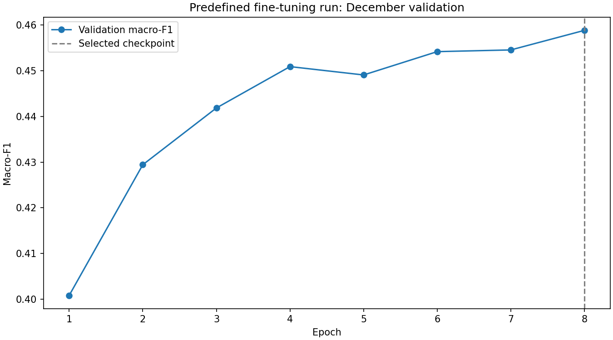
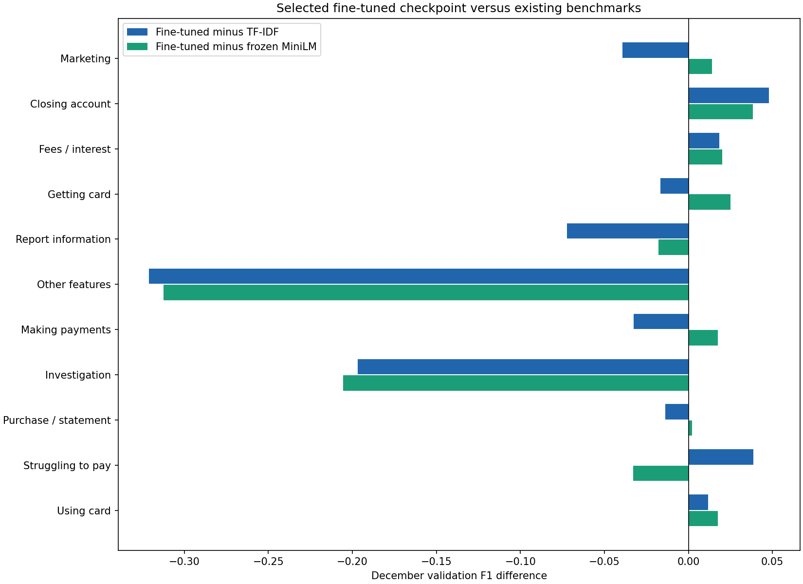

# Fine-tuned MiniLM: frozen-cohort validation benchmark

Single predefined protocol. All encoder/task-head updates and loss weights use November training data (2,424 narratives). December validation (2,695 narratives) selects the best epoch and stops training. No 2025 test file was read, hashed, inspected, tokenized, encoded, or scored. No cohort, duplicate, split, label, or validation-driven text-cleaning changes occurred. Earlier benchmark artifacts are protected by unchanged hashes.

## Native input-length verification

Exact pretrained checkpoint: sentence-transformers/all-MiniLM-L6-v2, revision `1110a243fdf4706b3f48f1d95db1a4f5529b4d41`. The saved SentenceTransformer wrapper default is **256**, tokenizer model_max_length is **512**, encoder max_position_embeddings is **512**, and the loaded position tensor is **512 × 384**. An actual 512-position forward pass succeeded before training (and independently on CPU). The largest native encoder input is therefore **512 total positions**, including CLS/SEP, leaving **510 content wordpieces**. Nothing was resized or extrapolated.

This distinguishes the sentence-embedding wrapper’s default policy from the encoder’s architectural limit. A longer supported input does not establish that the sentence encoder was pretrained effectively on all those lengths. Input handling uses the first 510 original wordpieces with simple right-tail truncation; the frozen comparator continues to use its original full-coverage chunk aggregation.

[Model card](https://huggingface.co/sentence-transformers/all-MiniLM-L6-v2) documents the wrapper default; local checkpoint configuration/tensor inspection and the successful forward pass establish the encoder limit. Evidence is in native_length_verification.json and native_length_check_prior_to_training.json.

## Selected-checkpoint validation metrics

| representation | configuration | macro_f1 | weighted_f1 | accuracy | balanced_accuracy |
| --- | --- | --- | --- | --- | --- |
| selected TF-IDF | tfidf_df2_C1.0_balanced | 0.5111 | 0.6279 | 0.6412 | 0.5117 |
| frozen MiniLM chunk aggregate | embedding_C4.0_balanced | 0.4983 | 0.6101 | 0.6037 | 0.5337 |
| fine-tuned MiniLM, tail truncation | best_epoch_8 | 0.4588 | 0.5776 | 0.6145 | 0.5066 |

Selected epoch: **8**. Completed epochs: 8; patience-based early stop triggered: False. Selection uses macro-F1 only, with the earlier epoch retained on exact ties. best_checkpoint.json and best_model.safetensors identify the selected checkpoint.

## Validation metrics after every epoch

| epoch | macro_f1 | weighted_f1 | accuracy | balanced_accuracy | training_weighted_loss | training_seconds | validation_inference_seconds |
| --- | --- | --- | --- | --- | --- | --- | --- |
| 1 | 0.4008 | 0.5241 | 0.5610 | 0.4480 | 2.3718 | 28.4785 | 11.1865 |
| 2 | 0.4294 | 0.5521 | 0.5948 | 0.4637 | 2.1129 | 36.3723 | 14.3381 |
| 3 | 0.4418 | 0.5648 | 0.6052 | 0.4822 | 1.8529 | 41.1760 | 20.0982 |
| 4 | 0.4509 | 0.5710 | 0.6063 | 0.5008 | 1.6833 | 52.7807 | 25.3157 |
| 5 | 0.4491 | 0.5722 | 0.6104 | 0.4989 | 1.5672 | 68.2499 | 27.9332 |
| 6 | 0.4542 | 0.5762 | 0.6137 | 0.5011 | 1.4799 | 39.0278 | 15.6179 |
| 7 | 0.4545 | 0.5753 | 0.6122 | 0.5024 | 1.4243 | 35.1742 | 14.0694 |
| 8 | 0.4588 | 0.5776 | 0.6145 | 0.5066 | 1.3872 | 33.8506 | 16.4964 |

## Selected fine-tuned model: per-class validation metrics

| Issue | precision | recall | f1 | support |
| --- | --- | --- | --- | --- |
| Advertising and marketing, including promotional offers | 0.4495 | 0.6490 | 0.5312 | 151 |
| Closing your account | 0.6552 | 0.6552 | 0.6552 | 232 |
| Fees or interest | 0.6430 | 0.7577 | 0.6957 | 359 |
| Getting a credit card | 0.6597 | 0.7129 | 0.6853 | 310 |
| Incorrect information on your report | 0.2250 | 0.5357 | 0.3169 | 84 |
| Other features, terms, or problems | 0.3333 | 0.0114 | 0.0221 | 350 |
| Problem when making payments | 0.4538 | 0.5330 | 0.4902 | 212 |
| Problem with a company's investigation into an existing problem | 0.0000 | 0.0000 | 0.0000 | 46 |
| Problem with a purchase shown on your statement | 0.7967 | 0.8517 | 0.8232 | 782 |
| Struggling to pay your bill | 0.3056 | 0.3143 | 0.3099 | 35 |
| Trouble using your card | 0.4868 | 0.5522 | 0.5175 | 134 |

## Direct per-class F1 comparisons

| Issue | f1_tfidf | f1_embedding | f1_finetuned | f1_difference_finetuned_minus_tfidf | f1_difference_finetuned_minus_frozen | support_finetuned |
| --- | --- | --- | --- | --- | --- | --- |
| Advertising and marketing, including promotional offers | 0.5704 | 0.5171 | 0.5312 | -0.0393 | +0.0140 | 151 |
| Closing your account | 0.6072 | 0.6167 | 0.6552 | +0.0480 | +0.0385 | 232 |
| Fees or interest | 0.6772 | 0.6754 | 0.6957 | +0.0184 | +0.0203 | 359 |
| Getting a credit card | 0.7019 | 0.6603 | 0.6853 | -0.0166 | +0.0250 | 310 |
| Incorrect information on your report | 0.3892 | 0.3348 | 0.3169 | -0.0723 | -0.0179 | 84 |
| Other features, terms, or problems | 0.3431 | 0.3345 | 0.0221 | -0.3210 | -0.3124 | 350 |
| Problem when making payments | 0.5229 | 0.4727 | 0.4902 | -0.0326 | +0.0175 | 212 |
| Problem with a company's investigation into an existing problem | 0.1967 | 0.2055 | 0.0000 | -0.1967 | -0.2055 | 46 |
| Problem with a purchase shown on your statement | 0.8369 | 0.8211 | 0.8232 | -0.0136 | +0.0021 | 782 |
| Struggling to pay your bill | 0.2712 | 0.3429 | 0.3099 | +0.0387 | -0.0330 | 35 |
| Trouble using your card | 0.5058 | 0.5000 | 0.5175 | +0.0116 | +0.0175 | 134 |

per_label_comparison.csv includes all three models’ precision, recall, F1, support, and signed F1 differences. Existing comparator settings and scores were imported unchanged. Small-support labels and development-set selection limit interpretation of differences; there is no test-year generalization estimate.

## Token retention: overall

| split | narratives | truncated_count | truncated_percent | mean_narrative_retained_percent | corpus_tokens_retained_percent | retain_at_least_50_percent_narratives | retain_at_least_75_percent_narratives | retain_at_least_90_percent_narratives | retain_at_least_100_percent_narratives |
| --- | --- | --- | --- | --- | --- | --- | --- | --- | --- |
| train | 2424 | 309 | 12.75 | 96.40 | 85.68 | 97.94 | 93.77 | 90.10 | 87.25 |
| validation | 2695 | 327 | 12.13 | 96.50 | 86.17 | 97.88 | 93.80 | 90.32 | 87.87 |

Retention is retained content wordpieces / original content wordpieces, excluding special tokens and padding. Threshold columns are percentages of narratives retaining at least 50%, 75%, 90%, or 100%. Mean narrative retention weights each narrative equally; corpus-token retention weights longer narratives more. Narrative-retention quantiles (min/p10/p25/median/p75/p90/max) are in the CSVs. Token counts match the earlier frozen-embedding audit exactly.

## Token retention by Issue

### train

| Issue | narratives | truncated_count | truncated_percent | mean_narrative_retained_percent | retain_at_least_50_percent_narratives | retain_at_least_75_percent_narratives | retain_at_least_90_percent_narratives | retain_at_least_100_percent_narratives |
| --- | --- | --- | --- | --- | --- | --- | --- | --- |
| Advertising and marketing, including promotional offers | 129 | 13 | 10.08 | 97.72 | 99.22 | 96.90 | 92.25 | 89.92 |
| Closing your account | 211 | 36 | 17.06 | 96.03 | 98.58 | 93.36 | 88.15 | 82.94 |
| Fees or interest | 328 | 34 | 10.37 | 97.10 | 98.17 | 94.82 | 91.77 | 89.63 |
| Getting a credit card | 291 | 21 | 7.22 | 97.99 | 99.31 | 96.56 | 94.16 | 92.78 |
| Incorrect information on your report | 94 | 1 | 1.06 | 99.93 | 100.00 | 100.00 | 100.00 | 98.94 |
| Other features, terms, or problems | 322 | 41 | 12.73 | 96.83 | 98.45 | 94.41 | 90.99 | 87.27 |
| Problem when making payments | 168 | 25 | 14.88 | 95.72 | 97.62 | 92.86 | 88.69 | 85.12 |
| Problem with a company's investigation into an existing problem | 46 | 5 | 10.87 | 96.07 | 95.65 | 91.30 | 91.30 | 89.13 |
| Problem with a purchase shown on your statement | 682 | 118 | 17.30 | 94.60 | 96.63 | 90.32 | 86.07 | 82.70 |
| Struggling to pay your bill | 37 | 3 | 8.11 | 98.28 | 100.00 | 97.30 | 91.89 | 91.89 |
| Trouble using your card | 116 | 12 | 10.34 | 96.79 | 96.55 | 95.69 | 90.52 | 89.66 |

### validation

| Issue | narratives | truncated_count | truncated_percent | mean_narrative_retained_percent | retain_at_least_50_percent_narratives | retain_at_least_75_percent_narratives | retain_at_least_90_percent_narratives | retain_at_least_100_percent_narratives |
| --- | --- | --- | --- | --- | --- | --- | --- | --- |
| Advertising and marketing, including promotional offers | 151 | 19 | 12.58 | 96.22 | 97.35 | 92.72 | 90.07 | 87.42 |
| Closing your account | 232 | 23 | 9.91 | 97.50 | 99.14 | 95.26 | 92.24 | 90.09 |
| Fees or interest | 359 | 37 | 10.31 | 97.27 | 98.33 | 94.71 | 92.20 | 89.69 |
| Getting a credit card | 310 | 19 | 6.13 | 97.57 | 98.06 | 95.81 | 94.19 | 93.87 |
| Incorrect information on your report | 84 | 4 | 4.76 | 98.69 | 100.00 | 97.62 | 95.24 | 95.24 |
| Other features, terms, or problems | 350 | 56 | 16.00 | 96.06 | 98.86 | 93.14 | 87.71 | 84.00 |
| Problem when making payments | 212 | 24 | 11.32 | 97.35 | 98.11 | 96.23 | 91.98 | 88.68 |
| Problem with a company's investigation into an existing problem | 46 | 3 | 6.52 | 98.22 | 100.00 | 95.65 | 95.65 | 93.48 |
| Problem with a purchase shown on your statement | 782 | 123 | 15.73 | 95.15 | 96.68 | 91.30 | 87.08 | 84.27 |
| Struggling to pay your bill | 35 | 1 | 2.86 | 98.18 | 97.14 | 97.14 | 97.14 | 97.14 |
| Trouble using your card | 134 | 18 | 13.43 | 95.85 | 97.01 | 94.03 | 89.55 | 86.57 |

All truncation is explicit in narrative_retention_audit.csv and retention_by_issue.csv. No record is removed for length. The classifier cannot see discarded tail tokens; this policy differs from the frozen benchmark’s complete-token chunking, so score differences combine training and input-policy effects.

## Fixed protocol and runtime

AdamW: encoder LR=2e-05, new task-head LR=0.001, weight decay 0.01 except biases/LayerNorm weights; betas=(0.9,0.999), epsilon=1e-8. Eight-epoch maximum, patience=2, batch size=8, accumulation=4 (effective 32 except the final 24-example window), evaluation batch=16. Linear schedule with 61 warmup steps out of 608 maximum optimizer steps. Float32, gradient clipping=1, no mixed precision, seed=20261008. Only one protocol was run; no LR/epoch grid or feature cleaning was selected on validation.

Loss weights are N_train/(11*n_train_class), matching the inverse-frequency rationale of balanced logistic regression. Loss is the weighted per-example negative log likelihood averaged over each accumulation window’s actual number of examples, not renormalized independently in each tiny batch. weights are saved in loss_weights.csv. No class resampling is applied.

The original encoder structure, positional table size, pretrained-style masked mean pooling, and L2 normalization are preserved. A required 11-class linear task head with dropout 0.1 is added; it is initialized with normal std=0.02 and zero bias. All encoder parameters and the task head are fine-tuned, although the original unused BERT pooler receives no task gradient. Position values may learn during fine-tuning but the table is never extended.

Device: cuda; GPU: NVIDIA GeForce RTX 3070 Laptop GPU; CUDA runtime: 12.1. Deterministic algorithms enabled; TF32 disabled; eager attention; four CPU threads. Summed epoch training time: 335.11s. Summed per-epoch validation inference: 145.06s. Training-plus-selection wall time: 481.43s. Selected-checkpoint validation inference: 15.55s (includes dynamic padding, host-to-device transfer, model forward, and prediction collection; excludes tokenization). Tokenization: 2.45s. Total benchmark runtime: 518.77s, excluding installation and later verification/reporting.

Best-checkpoint SHA-256: `c81e3adba765d98548990a96a75037a2c508e93536b0b0b853998a1367e3d3fd`. Initial and selected encoder-state hashes differ, verifying actual fine-tuning; the positional tensor remains 512×384. Reloaded best-checkpoint predictions match its saved epoch predictions.

experiment_config.json is saved before training. epoch_history.csv persists validation macro-F1 after every epoch, with losses, runtime, optimizer step and LR. All epoch validation predictions are retained. Selected per-class metrics and confusion matrix are saved. run_manifest.json and requirements-lock.txt record exact Python/package versions, source hashes, pretrained files/revision, GPU/runtime, input/protected-artifact hashes, and integrity checks. Previous environments were not altered. The separate .venv-finetune environment uses PyTorch CUDA 12.1 wheels. Rebuild with run_finetune_benchmark.py, then report_finetune_benchmark.py. No training-plus-validation refit or test inference was performed.
