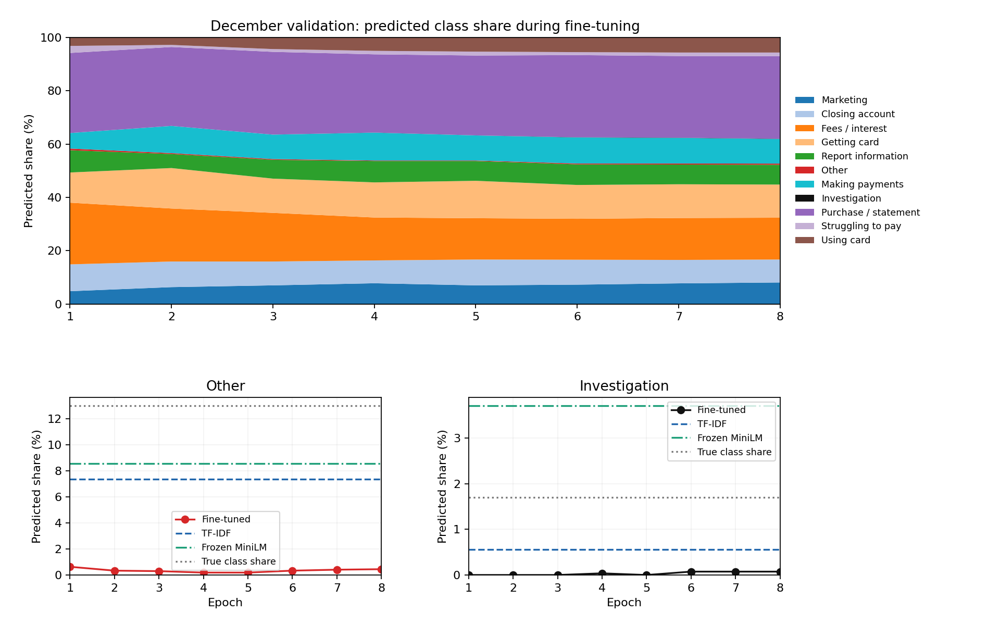

# December validation: epoch class shares and flows

Saved predictions only: no training, model loading, new epochs, loss changes, narrative access, or 2025 access. All ten prediction files have identical December complaint IDs and true labels. Class names in tables are shortened only for display; CSVs retain the exact frozen labels.

## Findings

Other is severely under-predicted from epoch 1: counts are 17, 9, 8, 5, 5, 9, 11, 12 (0.19–0.63% of predictions), against 350 true examples (12.99%). This is not monotonic disappearance: prediction mass bottoms out at epochs 4–5, then partly recovers. Correct Other predictions are 7, 7, 4, 2, 2, 3, 3, 4. Epoch-8 recall is 1.14%, compared with 26.86% for TF-IDF and 27.71% for frozen MiniLM. Other is the third-largest training label (322 examples), so its suppression cannot be explained simply as rarity.

Investigation is effectively absent from the start: prediction counts 0, 0, 0, 1, 0, 2, 2, 2, with zero correct predictions at every epoch. Its 46 true examples represent 1.71% of validation. TF-IDF predicts 15 Investigation examples with 6 correct; frozen MiniLM predicts 100 with 15 correct. Frozen MiniLM increases Investigation recall at the cost of precision (15%).

At epoch 8, true Other examples disperse chiefly to Purchase (76/350, 21.71%), Marketing (72/350, 20.57%), and Payments (43/350, 12.29%). For those destinations TF-IDF counts are 68, 30, 26, and frozen MiniLM counts are 45, 36, 24. Other suppression is spread across multiple alternative labels, rather than a single replacement class.

Investigation has a more concentrated substitution: 24/46 (52.17%) go to Incorrect information on your report at both epochs 1 and 8, compared with 10/46 (21.74%) for TF-IDF and 14/46 (30.43%) for frozen MiniLM. At epoch 8, another 8 go to Purchase and 7 to Getting a credit card. The two epoch-8 Investigation predictions are actually one Payments and one Purchase example. The 12 epoch-8 Other predictions comprise 4 true Other, 3 Fees, 3 Purchase, and 2 Closing-account examples.

Interpretation: the visible failure is specific class suppression already present after the first epoch, not progressive loss of all classes as aggregate macro-F1 improves. Other is not a minority training class; Investigation is. Their different outgoing patterns suggest distinct label-boundary difficulties. These predictions alone cannot separate optimization, representation changes, loss behavior, input truncation, or label overlap as causes. Baselines have stronger recognition of both labels, so the frozen labels are not wholly unlearnable. Epoch 0 predictions were not saved, so the onset within epoch 1 is unknown. No additional training or label decision is justified solely by this audit.

Top: all 11 prediction shares sum to 100% at each epoch. Bottom: separate scales expose Other and Investigation, with unchanged baseline prediction shares and true prevalence for context.

## Predictions and per-class metrics at every epoch

Share is percentage of all 2,695 validation predictions. Metrics use the fixed 11-label order and zero_division=0; zero predicted examples makes precision undefined, reported as 0.

### Epoch 1

| Issue | true_support | predicted_count | predicted_share_percent | precision | recall | f1 |
| --- | --- | --- | --- | --- | --- | --- |
| Marketing | 151 | 130 | 4.8237 | 0.5154 | 0.4437 | 0.4769 |
| Closing account | 232 | 271 | 10.0557 | 0.5351 | 0.6250 | 0.5765 |
| Fees / interest | 359 | 624 | 23.1540 | 0.4936 | 0.8579 | 0.6267 |
| Getting card | 310 | 305 | 11.3173 | 0.6197 | 0.6097 | 0.6146 |
| Report information | 84 | 225 | 8.3488 | 0.2089 | 0.5595 | 0.3042 |
| Other | 350 | 17 | 0.6308 | 0.4118 | 0.0200 | 0.0381 |
| Making payments | 212 | 157 | 5.8256 | 0.4968 | 0.3679 | 0.4228 |
| Investigation | 46 | 0 | 0.0000 | 0.0000 | 0.0000 | 0.0000 |
| Purchase / statement | 782 | 810 | 30.0557 | 0.7704 | 0.7980 | 0.7839 |
| Struggling to pay | 35 | 71 | 2.6345 | 0.1972 | 0.4000 | 0.2642 |
| Using card | 134 | 85 | 3.1540 | 0.3882 | 0.2463 | 0.3014 |

### Epoch 2

| Issue | true_support | predicted_count | predicted_share_percent | precision | recall | f1 |
| --- | --- | --- | --- | --- | --- | --- |
| Marketing | 151 | 171 | 6.3451 | 0.4971 | 0.5629 | 0.5280 |
| Closing account | 232 | 259 | 9.6104 | 0.5869 | 0.6552 | 0.6191 |
| Fees / interest | 359 | 536 | 19.8887 | 0.5578 | 0.8329 | 0.6682 |
| Getting card | 310 | 409 | 15.1763 | 0.5477 | 0.7226 | 0.6231 |
| Report information | 84 | 142 | 5.2690 | 0.2676 | 0.4524 | 0.3363 |
| Other | 350 | 9 | 0.3340 | 0.7778 | 0.0200 | 0.0390 |
| Making payments | 212 | 275 | 10.2041 | 0.4182 | 0.5425 | 0.4723 |
| Investigation | 46 | 0 | 0.0000 | 0.0000 | 0.0000 | 0.0000 |
| Purchase / statement | 782 | 798 | 29.6104 | 0.7970 | 0.8133 | 0.8051 |
| Struggling to pay | 35 | 21 | 0.7792 | 0.3333 | 0.2000 | 0.2500 |
| Using card | 134 | 75 | 2.7829 | 0.5333 | 0.2985 | 0.3828 |

### Epoch 3

| Issue | true_support | predicted_count | predicted_share_percent | precision | recall | f1 |
| --- | --- | --- | --- | --- | --- | --- |
| Marketing | 151 | 189 | 7.0130 | 0.4815 | 0.6026 | 0.5353 |
| Closing account | 232 | 241 | 8.9425 | 0.6224 | 0.6466 | 0.6342 |
| Fees / interest | 359 | 492 | 18.2560 | 0.5874 | 0.8050 | 0.6792 |
| Getting card | 310 | 346 | 12.8386 | 0.6243 | 0.6968 | 0.6585 |
| Report information | 84 | 190 | 7.0501 | 0.2263 | 0.5119 | 0.3139 |
| Other | 350 | 8 | 0.2968 | 0.5000 | 0.0114 | 0.0223 |
| Making payments | 212 | 247 | 9.1651 | 0.4413 | 0.5142 | 0.4749 |
| Investigation | 46 | 0 | 0.0000 | 0.0000 | 0.0000 | 0.0000 |
| Purchase / statement | 782 | 837 | 31.0575 | 0.7909 | 0.8465 | 0.8178 |
| Struggling to pay | 35 | 28 | 1.0390 | 0.2857 | 0.2286 | 0.2540 |
| Using card | 134 | 117 | 4.3414 | 0.5043 | 0.4403 | 0.4701 |

### Epoch 4

| Issue | true_support | predicted_count | predicted_share_percent | precision | recall | f1 |
| --- | --- | --- | --- | --- | --- | --- |
| Marketing | 151 | 210 | 7.7922 | 0.4476 | 0.6225 | 0.5208 |
| Closing account | 232 | 231 | 8.5714 | 0.6580 | 0.6552 | 0.6566 |
| Fees / interest | 359 | 434 | 16.1039 | 0.6313 | 0.7632 | 0.6910 |
| Getting card | 310 | 355 | 13.1725 | 0.6225 | 0.7129 | 0.6647 |
| Report information | 84 | 216 | 8.0148 | 0.2222 | 0.5714 | 0.3200 |
| Other | 350 | 5 | 0.1855 | 0.4000 | 0.0057 | 0.0113 |
| Making payments | 212 | 282 | 10.4638 | 0.4043 | 0.5377 | 0.4615 |
| Investigation | 46 | 1 | 0.0371 | 0.0000 | 0.0000 | 0.0000 |
| Purchase / statement | 782 | 791 | 29.3506 | 0.8243 | 0.8338 | 0.8290 |
| Struggling to pay | 35 | 35 | 1.2987 | 0.3143 | 0.3143 | 0.3143 |
| Using card | 134 | 135 | 5.0093 | 0.4889 | 0.4925 | 0.4907 |

### Epoch 5

| Issue | true_support | predicted_count | predicted_share_percent | precision | recall | f1 |
| --- | --- | --- | --- | --- | --- | --- |
| Marketing | 151 | 189 | 7.0130 | 0.4709 | 0.5894 | 0.5235 |
| Closing account | 232 | 261 | 9.6846 | 0.6322 | 0.7112 | 0.6694 |
| Fees / interest | 359 | 418 | 15.5102 | 0.6435 | 0.7493 | 0.6924 |
| Getting card | 310 | 378 | 14.0260 | 0.6005 | 0.7323 | 0.6599 |
| Report information | 84 | 200 | 7.4212 | 0.2300 | 0.5476 | 0.3239 |
| Other | 350 | 5 | 0.1855 | 0.4000 | 0.0057 | 0.0113 |
| Making payments | 212 | 254 | 9.4249 | 0.4370 | 0.5236 | 0.4764 |
| Investigation | 46 | 0 | 0.0000 | 0.0000 | 0.0000 | 0.0000 |
| Purchase / statement | 782 | 808 | 29.9814 | 0.8156 | 0.8427 | 0.8289 |
| Struggling to pay | 35 | 39 | 1.4471 | 0.2564 | 0.2857 | 0.2703 |
| Using card | 134 | 143 | 5.3061 | 0.4685 | 0.5000 | 0.4838 |

### Epoch 6

| Issue | true_support | predicted_count | predicted_share_percent | precision | recall | f1 |
| --- | --- | --- | --- | --- | --- | --- |
| Marketing | 151 | 196 | 7.2727 | 0.4745 | 0.6159 | 0.5360 |
| Closing account | 232 | 252 | 9.3506 | 0.6389 | 0.6940 | 0.6653 |
| Fees / interest | 359 | 414 | 15.3618 | 0.6546 | 0.7549 | 0.7012 |
| Getting card | 310 | 342 | 12.6902 | 0.6491 | 0.7161 | 0.6810 |
| Report information | 84 | 208 | 7.7180 | 0.2260 | 0.5595 | 0.3219 |
| Other | 350 | 9 | 0.3340 | 0.3333 | 0.0086 | 0.0167 |
| Making payments | 212 | 263 | 9.7588 | 0.4373 | 0.5425 | 0.4842 |
| Investigation | 46 | 2 | 0.0742 | 0.0000 | 0.0000 | 0.0000 |
| Purchase / statement | 782 | 831 | 30.8349 | 0.7990 | 0.8491 | 0.8233 |
| Struggling to pay | 35 | 30 | 1.1132 | 0.3000 | 0.2571 | 0.2769 |
| Using card | 134 | 148 | 5.4917 | 0.4662 | 0.5149 | 0.4894 |

### Epoch 7

| Issue | true_support | predicted_count | predicted_share_percent | precision | recall | f1 |
| --- | --- | --- | --- | --- | --- | --- |
| Marketing | 151 | 209 | 7.7551 | 0.4593 | 0.6358 | 0.5333 |
| Closing account | 232 | 237 | 8.7941 | 0.6540 | 0.6681 | 0.6610 |
| Fees / interest | 359 | 424 | 15.7328 | 0.6415 | 0.7577 | 0.6948 |
| Getting card | 310 | 341 | 12.6531 | 0.6540 | 0.7194 | 0.6851 |
| Report information | 84 | 199 | 7.3840 | 0.2261 | 0.5357 | 0.3180 |
| Other | 350 | 11 | 0.4082 | 0.2727 | 0.0086 | 0.0166 |
| Making payments | 212 | 259 | 9.6104 | 0.4363 | 0.5330 | 0.4798 |
| Investigation | 46 | 2 | 0.0742 | 0.0000 | 0.0000 | 0.0000 |
| Purchase / statement | 782 | 826 | 30.6494 | 0.8002 | 0.8453 | 0.8221 |
| Struggling to pay | 35 | 35 | 1.2987 | 0.2857 | 0.2857 | 0.2857 |
| Using card | 134 | 152 | 5.6401 | 0.4737 | 0.5373 | 0.5035 |

### Epoch 8

| Issue | true_support | predicted_count | predicted_share_percent | precision | recall | f1 |
| --- | --- | --- | --- | --- | --- | --- |
| Marketing | 151 | 218 | 8.0891 | 0.4495 | 0.6490 | 0.5312 |
| Closing account | 232 | 232 | 8.6085 | 0.6552 | 0.6552 | 0.6552 |
| Fees / interest | 359 | 423 | 15.6957 | 0.6430 | 0.7577 | 0.6957 |
| Getting card | 310 | 335 | 12.4304 | 0.6597 | 0.7129 | 0.6853 |
| Report information | 84 | 200 | 7.4212 | 0.2250 | 0.5357 | 0.3169 |
| Other | 350 | 12 | 0.4453 | 0.3333 | 0.0114 | 0.0221 |
| Making payments | 212 | 249 | 9.2393 | 0.4538 | 0.5330 | 0.4902 |
| Investigation | 46 | 2 | 0.0742 | 0.0000 | 0.0000 | 0.0000 |
| Purchase / statement | 782 | 836 | 31.0204 | 0.7967 | 0.8517 | 0.8232 |
| Struggling to pay | 35 | 36 | 1.3358 | 0.3056 | 0.3143 | 0.3099 |
| Using card | 134 | 152 | 5.6401 | 0.4868 | 0.5522 | 0.5175 |

### TF-IDF

| Issue | true_support | predicted_count | predicted_share_percent | precision | recall | f1 |
| --- | --- | --- | --- | --- | --- | --- |
| Marketing | 151 | 133 | 4.9351 | 0.6090 | 0.5364 | 0.5704 |
| Closing account | 232 | 239 | 8.8683 | 0.5983 | 0.6164 | 0.6072 |
| Fees / interest | 359 | 400 | 14.8423 | 0.6425 | 0.7159 | 0.6772 |
| Getting card | 310 | 391 | 14.5083 | 0.6292 | 0.7935 | 0.7019 |
| Report information | 84 | 101 | 3.7477 | 0.3564 | 0.4286 | 0.3892 |
| Other | 350 | 198 | 7.3469 | 0.4747 | 0.2686 | 0.3431 |
| Making payments | 212 | 247 | 9.1651 | 0.4858 | 0.5660 | 0.5229 |
| Investigation | 46 | 15 | 0.5566 | 0.4000 | 0.1304 | 0.1967 |
| Purchase / statement | 782 | 824 | 30.5751 | 0.8155 | 0.8593 | 0.8369 |
| Struggling to pay | 35 | 24 | 0.8905 | 0.3333 | 0.2286 | 0.2712 |
| Using card | 134 | 123 | 4.5640 | 0.5285 | 0.4851 | 0.5058 |

### Frozen MiniLM

| Issue | true_support | predicted_count | predicted_share_percent | precision | recall | f1 |
| --- | --- | --- | --- | --- | --- | --- |
| Marketing | 151 | 170 | 6.3080 | 0.4882 | 0.5497 | 0.5171 |
| Closing account | 232 | 248 | 9.2022 | 0.5968 | 0.6379 | 0.6167 |
| Fees / interest | 359 | 328 | 12.1707 | 0.7073 | 0.6462 | 0.6754 |
| Getting card | 310 | 314 | 11.6512 | 0.6561 | 0.6645 | 0.6603 |
| Report information | 84 | 137 | 5.0835 | 0.2701 | 0.4405 | 0.3348 |
| Other | 350 | 230 | 8.5343 | 0.4217 | 0.2771 | 0.3345 |
| Making payments | 212 | 228 | 8.4601 | 0.4561 | 0.4906 | 0.4727 |
| Investigation | 46 | 100 | 3.7106 | 0.1500 | 0.3261 | 0.2055 |
| Purchase / statement | 782 | 716 | 26.5677 | 0.8589 | 0.7864 | 0.8211 |
| Struggling to pay | 35 | 70 | 2.5974 | 0.2571 | 0.5143 | 0.3429 |
| Using card | 134 | 154 | 5.7143 | 0.4675 | 0.5373 | 0.5000 |

## Two-way flows and baseline comparisons

Each cell is count (conditional percentage). Outgoing rows condition on the true focal class and include correct predictions. Incoming rows condition on predictions assigned to the focal class and include correct predictions. An empty predicted class has denominator 0: its incoming percentages are undefined (NA), not 0%.

### Other: true examples → predicted labels

| Model | Denominator | Marketing | Closing account | Fees / interest | Getting card | Report information | Other | Making payments | Investigation | Purchase / statement | Struggling to pay | Using card |
| --- | --- | --- | --- | --- | --- | --- | --- | --- | --- | --- | --- | --- |
| Epoch 1 | 350 | 45 (12.9%) | 39 (11.1%) | 58 (16.6%) | 33 (9.4%) | 32 (9.1%) | 7 (2.0%) | 26 (7.4%) | 0 (0.0%) | 82 (23.4%) | 11 (3.1%) | 17 (4.9%) |
| Epoch 2 | 350 | 56 (16.0%) | 38 (10.9%) | 46 (13.1%) | 46 (13.1%) | 20 (5.7%) | 7 (2.0%) | 40 (11.4%) | 0 (0.0%) | 81 (23.1%) | 3 (0.9%) | 13 (3.7%) |
| Epoch 3 | 350 | 62 (17.7%) | 32 (9.1%) | 43 (12.3%) | 33 (9.4%) | 28 (8.0%) | 4 (1.1%) | 41 (11.7%) | 0 (0.0%) | 84 (24.0%) | 3 (0.9%) | 20 (5.7%) |
| Epoch 4 | 350 | 72 (20.6%) | 30 (8.6%) | 34 (9.7%) | 37 (10.6%) | 29 (8.3%) | 2 (0.6%) | 47 (13.4%) | 0 (0.0%) | 69 (19.7%) | 4 (1.1%) | 26 (7.4%) |
| Epoch 5 | 350 | 65 (18.6%) | 32 (9.1%) | 31 (8.9%) | 43 (12.3%) | 27 (7.7%) | 2 (0.6%) | 46 (13.1%) | 0 (0.0%) | 73 (20.9%) | 4 (1.1%) | 27 (7.7%) |
| Epoch 6 | 350 | 67 (19.1%) | 31 (8.9%) | 31 (8.9%) | 33 (9.4%) | 30 (8.6%) | 3 (0.9%) | 45 (12.9%) | 0 (0.0%) | 77 (22.0%) | 4 (1.1%) | 29 (8.3%) |
| Epoch 7 | 350 | 69 (19.7%) | 29 (8.3%) | 31 (8.9%) | 31 (8.9%) | 29 (8.3%) | 3 (0.9%) | 46 (13.1%) | 0 (0.0%) | 76 (21.7%) | 5 (1.4%) | 31 (8.9%) |
| Epoch 8 | 350 | 72 (20.6%) | 29 (8.3%) | 31 (8.9%) | 32 (9.1%) | 27 (7.7%) | 4 (1.1%) | 43 (12.3%) | 0 (0.0%) | 76 (21.7%) | 5 (1.4%) | 31 (8.9%) |
| TF-IDF | 350 | 30 (8.6%) | 39 (11.1%) | 25 (7.1%) | 33 (9.4%) | 12 (3.4%) | 94 (26.9%) | 26 (7.4%) | 1 (0.3%) | 68 (19.4%) | 3 (0.9%) | 19 (5.4%) |
| Frozen MiniLM | 350 | 36 (10.3%) | 36 (10.3%) | 24 (6.9%) | 26 (7.4%) | 11 (3.1%) | 97 (27.7%) | 24 (6.9%) | 17 (4.9%) | 45 (12.9%) | 9 (2.6%) | 25 (7.1%) |

### Other: predicted examples ← true labels

| Model | Denominator | Marketing | Closing account | Fees / interest | Getting card | Report information | Other | Making payments | Investigation | Purchase / statement | Struggling to pay | Using card |
| --- | --- | --- | --- | --- | --- | --- | --- | --- | --- | --- | --- | --- |
| Epoch 1 | 17 | 4 (23.5%) | 0 (0.0%) | 0 (0.0%) | 1 (5.9%) | 0 (0.0%) | 7 (41.2%) | 3 (17.6%) | 0 (0.0%) | 2 (11.8%) | 0 (0.0%) | 0 (0.0%) |
| Epoch 2 | 9 | 0 (0.0%) | 0 (0.0%) | 0 (0.0%) | 0 (0.0%) | 0 (0.0%) | 7 (77.8%) | 1 (11.1%) | 0 (0.0%) | 1 (11.1%) | 0 (0.0%) | 0 (0.0%) |
| Epoch 3 | 8 | 0 (0.0%) | 0 (0.0%) | 1 (12.5%) | 0 (0.0%) | 0 (0.0%) | 4 (50.0%) | 1 (12.5%) | 0 (0.0%) | 1 (12.5%) | 0 (0.0%) | 1 (12.5%) |
| Epoch 4 | 5 | 0 (0.0%) | 0 (0.0%) | 0 (0.0%) | 0 (0.0%) | 0 (0.0%) | 2 (40.0%) | 0 (0.0%) | 0 (0.0%) | 3 (60.0%) | 0 (0.0%) | 0 (0.0%) |
| Epoch 5 | 5 | 0 (0.0%) | 0 (0.0%) | 0 (0.0%) | 0 (0.0%) | 0 (0.0%) | 2 (40.0%) | 1 (20.0%) | 0 (0.0%) | 2 (40.0%) | 0 (0.0%) | 0 (0.0%) |
| Epoch 6 | 9 | 0 (0.0%) | 1 (11.1%) | 1 (11.1%) | 0 (0.0%) | 0 (0.0%) | 3 (33.3%) | 1 (11.1%) | 0 (0.0%) | 3 (33.3%) | 0 (0.0%) | 0 (0.0%) |
| Epoch 7 | 11 | 0 (0.0%) | 2 (18.2%) | 3 (27.3%) | 0 (0.0%) | 0 (0.0%) | 3 (27.3%) | 0 (0.0%) | 0 (0.0%) | 3 (27.3%) | 0 (0.0%) | 0 (0.0%) |
| Epoch 8 | 12 | 0 (0.0%) | 2 (16.7%) | 3 (25.0%) | 0 (0.0%) | 0 (0.0%) | 4 (33.3%) | 0 (0.0%) | 0 (0.0%) | 3 (25.0%) | 0 (0.0%) | 0 (0.0%) |
| TF-IDF | 198 | 16 (8.1%) | 11 (5.6%) | 14 (7.1%) | 15 (7.6%) | 0 (0.0%) | 94 (47.5%) | 10 (5.1%) | 1 (0.5%) | 21 (10.6%) | 5 (2.5%) | 11 (5.6%) |
| Frozen MiniLM | 230 | 22 (9.6%) | 8 (3.5%) | 12 (5.2%) | 17 (7.4%) | 0 (0.0%) | 97 (42.2%) | 21 (9.1%) | 0 (0.0%) | 39 (17.0%) | 2 (0.9%) | 12 (5.2%) |

### Investigation: true examples → predicted labels

| Model | Denominator | Marketing | Closing account | Fees / interest | Getting card | Report information | Other | Making payments | Investigation | Purchase / statement | Struggling to pay | Using card |
| --- | --- | --- | --- | --- | --- | --- | --- | --- | --- | --- | --- | --- |
| Epoch 1 | 46 | 0 (0.0%) | 1 (2.2%) | 5 (10.9%) | 5 (10.9%) | 24 (52.2%) | 0 (0.0%) | 4 (8.7%) | 0 (0.0%) | 4 (8.7%) | 1 (2.2%) | 2 (4.3%) |
| Epoch 2 | 46 | 0 (0.0%) | 2 (4.3%) | 2 (4.3%) | 10 (21.7%) | 19 (41.3%) | 0 (0.0%) | 7 (15.2%) | 0 (0.0%) | 5 (10.9%) | 0 (0.0%) | 1 (2.2%) |
| Epoch 3 | 46 | 0 (0.0%) | 1 (2.2%) | 1 (2.2%) | 6 (13.0%) | 27 (58.7%) | 0 (0.0%) | 4 (8.7%) | 0 (0.0%) | 6 (13.0%) | 0 (0.0%) | 1 (2.2%) |
| Epoch 4 | 46 | 0 (0.0%) | 1 (2.2%) | 1 (2.2%) | 6 (13.0%) | 27 (58.7%) | 0 (0.0%) | 4 (8.7%) | 0 (0.0%) | 6 (13.0%) | 0 (0.0%) | 1 (2.2%) |
| Epoch 5 | 46 | 0 (0.0%) | 1 (2.2%) | 1 (2.2%) | 7 (15.2%) | 25 (54.3%) | 0 (0.0%) | 3 (6.5%) | 0 (0.0%) | 7 (15.2%) | 1 (2.2%) | 1 (2.2%) |
| Epoch 6 | 46 | 0 (0.0%) | 1 (2.2%) | 1 (2.2%) | 6 (13.0%) | 27 (58.7%) | 0 (0.0%) | 3 (6.5%) | 0 (0.0%) | 6 (13.0%) | 1 (2.2%) | 1 (2.2%) |
| Epoch 7 | 46 | 0 (0.0%) | 1 (2.2%) | 1 (2.2%) | 7 (15.2%) | 24 (52.2%) | 0 (0.0%) | 3 (6.5%) | 0 (0.0%) | 8 (17.4%) | 1 (2.2%) | 1 (2.2%) |
| Epoch 8 | 46 | 0 (0.0%) | 1 (2.2%) | 1 (2.2%) | 7 (15.2%) | 24 (52.2%) | 0 (0.0%) | 3 (6.5%) | 0 (0.0%) | 8 (17.4%) | 1 (2.2%) | 1 (2.2%) |
| TF-IDF | 46 | 0 (0.0%) | 2 (4.3%) | 4 (8.7%) | 11 (23.9%) | 10 (21.7%) | 1 (2.2%) | 4 (8.7%) | 6 (13.0%) | 6 (13.0%) | 2 (4.3%) | 0 (0.0%) |
| Frozen MiniLM | 46 | 0 (0.0%) | 2 (4.3%) | 1 (2.2%) | 6 (13.0%) | 14 (30.4%) | 0 (0.0%) | 1 (2.2%) | 15 (32.6%) | 4 (8.7%) | 3 (6.5%) | 0 (0.0%) |

### Investigation: predicted examples ← true labels

| Model | Denominator | Marketing | Closing account | Fees / interest | Getting card | Report information | Other | Making payments | Investigation | Purchase / statement | Struggling to pay | Using card |
| --- | --- | --- | --- | --- | --- | --- | --- | --- | --- | --- | --- | --- |
| Epoch 1 | 0 | 0 (NA) | 0 (NA) | 0 (NA) | 0 (NA) | 0 (NA) | 0 (NA) | 0 (NA) | 0 (NA) | 0 (NA) | 0 (NA) | 0 (NA) |
| Epoch 2 | 0 | 0 (NA) | 0 (NA) | 0 (NA) | 0 (NA) | 0 (NA) | 0 (NA) | 0 (NA) | 0 (NA) | 0 (NA) | 0 (NA) | 0 (NA) |
| Epoch 3 | 0 | 0 (NA) | 0 (NA) | 0 (NA) | 0 (NA) | 0 (NA) | 0 (NA) | 0 (NA) | 0 (NA) | 0 (NA) | 0 (NA) | 0 (NA) |
| Epoch 4 | 1 | 0 (0.0%) | 0 (0.0%) | 0 (0.0%) | 0 (0.0%) | 0 (0.0%) | 0 (0.0%) | 0 (0.0%) | 0 (0.0%) | 1 (100.0%) | 0 (0.0%) | 0 (0.0%) |
| Epoch 5 | 0 | 0 (NA) | 0 (NA) | 0 (NA) | 0 (NA) | 0 (NA) | 0 (NA) | 0 (NA) | 0 (NA) | 0 (NA) | 0 (NA) | 0 (NA) |
| Epoch 6 | 2 | 0 (0.0%) | 0 (0.0%) | 0 (0.0%) | 0 (0.0%) | 0 (0.0%) | 0 (0.0%) | 1 (50.0%) | 0 (0.0%) | 1 (50.0%) | 0 (0.0%) | 0 (0.0%) |
| Epoch 7 | 2 | 0 (0.0%) | 0 (0.0%) | 0 (0.0%) | 0 (0.0%) | 0 (0.0%) | 0 (0.0%) | 1 (50.0%) | 0 (0.0%) | 1 (50.0%) | 0 (0.0%) | 0 (0.0%) |
| Epoch 8 | 2 | 0 (0.0%) | 0 (0.0%) | 0 (0.0%) | 0 (0.0%) | 0 (0.0%) | 0 (0.0%) | 1 (50.0%) | 0 (0.0%) | 1 (50.0%) | 0 (0.0%) | 0 (0.0%) |
| TF-IDF | 15 | 0 (0.0%) | 0 (0.0%) | 0 (0.0%) | 3 (20.0%) | 1 (6.7%) | 1 (6.7%) | 3 (20.0%) | 6 (40.0%) | 0 (0.0%) | 0 (0.0%) | 1 (6.7%) |
| Frozen MiniLM | 100 | 4 (4.0%) | 4 (4.0%) | 6 (6.0%) | 11 (11.0%) | 12 (12.0%) | 17 (17.0%) | 14 (14.0%) | 15 (15.0%) | 11 (11.0%) | 0 (0.0%) | 6 (6.0%) |

## Disappearance flags

| Issue | monotonically_nonincreasing | first_zero_prediction_epoch | absent_at_final_epoch | final_vs_first_prediction_count_change_percent |
| --- | --- | --- | --- | --- |
| Other features, terms, or problems | False | nan | False | -29.41176470588235 |
| Problem with a company's investigation into an existing problem | False | 1.0 | False | nan |

These are descriptive validation diagnostics. A shrinking prediction share does not by itself identify the causal mechanism; confusion flows show which labels receive the displaced examples. No further training or cleaning decision is made here.
