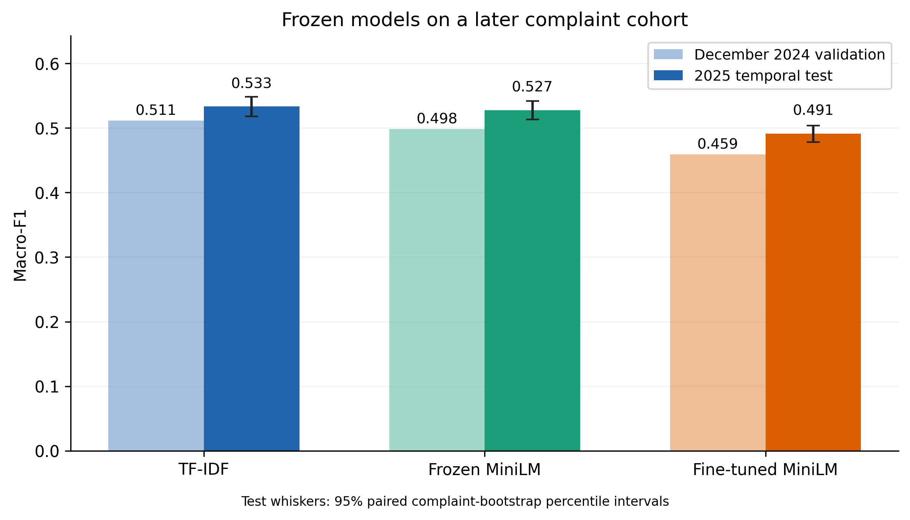
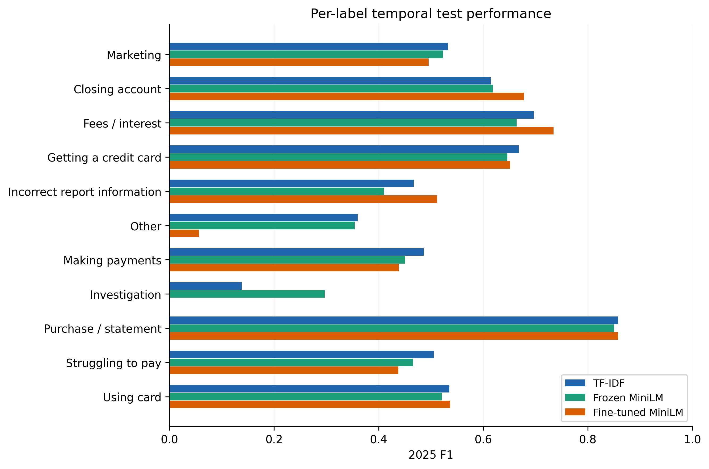
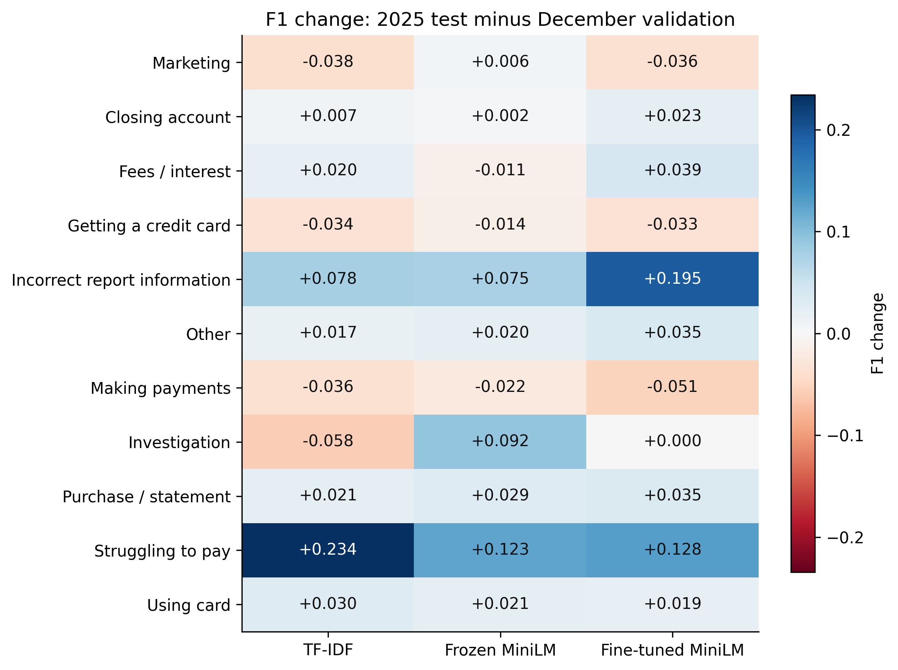

# Final frozen temporal test evaluation

The actual development-selected models were evaluated once on 6,521 frozen 2025 narratives. No November+December refit, retraining, tuning, calibration, threshold/class-weight change, label change, or feature cleaning occurred. Predictive input was narrative text only. Test integrity checks were completed before inference. Earlier artifacts remain unchanged.

## Validation and temporal test metrics

### macro_f1

| model | macro_f1_validation | macro_f1_test | macro_f1_change |
| --- | --- | --- | --- |
| TF-IDF | 0.5111 | 0.5331 | 0.0220 |
| Frozen MiniLM | 0.4983 | 0.5275 | 0.0292 |
| Fine-tuned MiniLM | 0.4588 | 0.4910 | 0.0322 |

### weighted_f1

| model | weighted_f1_validation | weighted_f1_test | weighted_f1_change |
| --- | --- | --- | --- |
| TF-IDF | 0.6279 | 0.6386 | 0.0107 |
| Frozen MiniLM | 0.6101 | 0.6274 | 0.0173 |
| Fine-tuned MiniLM | 0.5776 | 0.6027 | 0.0251 |

### accuracy

| model | accuracy_validation | accuracy_test | accuracy_change |
| --- | --- | --- | --- |
| TF-IDF | 0.6412 | 0.6528 | 0.0116 |
| Frozen MiniLM | 0.6037 | 0.6235 | 0.0198 |
| Fine-tuned MiniLM | 0.6145 | 0.6433 | 0.0288 |

### balanced_accuracy

| model | balanced_accuracy_validation | balanced_accuracy_test | balanced_accuracy_change |
| --- | --- | --- | --- |
| TF-IDF | 0.5117 | 0.5405 | 0.0288 |
| Frozen MiniLM | 0.5337 | 0.5695 | 0.0358 |
| Fine-tuned MiniLM | 0.5066 | 0.5448 | 0.0382 |

Test macro-F1 ranking: TF-IDF > Frozen MiniLM > Fine-tuned MiniLM. This is a descriptive ranking; paired uncertainty is reported below.



## Paired bootstrap uncertainty

| estimand | estimate | lower_95 | upper_95 | bootstrap_se |
| --- | --- | --- | --- | --- |
| TF-IDF | 0.5331 | 0.5177 | 0.5481 | 0.0078 |
| Frozen MiniLM | 0.5275 | 0.5132 | 0.5418 | 0.0073 |
| Fine-tuned MiniLM | 0.4910 | 0.4779 | 0.5036 | 0.0066 |
| TF-IDF minus Frozen MiniLM | 0.0056 | -0.0104 | 0.0211 | 0.0080 |
| TF-IDF minus Fine-tuned MiniLM | 0.0421 | 0.0269 | 0.0569 | 0.0076 |
| Frozen MiniLM minus Fine-tuned MiniLM | 0.0365 | 0.0223 | 0.0507 | 0.0072 |

10,000 ordinary IID bootstrap replicates, seed 20261009. Each draws 6,521 complaint indices with replacement; the same indices are used for all three models. Fixed 11-label macro-F1, zero_division=0, percentile 2.5/97.5 intervals. No stratification, tuning, or selection from bootstrap results. Full replicate scores/differences are saved. Runtime 1.35s.

Intervals quantify resampling uncertainty conditional on this frozen sample and fitted models. They do not include development selection, label uncertainty, retrospective cohort design, or future population uncertainty. Complaint-level resampling assumes retained complaints are sufficiently independent; undetected related narratives could make intervals optimistic.

## Descriptive generalization findings

The development macro-F1 ranking persists on the temporal test cohort.

TF-IDF minus Frozen MiniLM: +0.0056, 95% paired interval [-0.0104, +0.0211]. The interval includes zero; the numerical ordering does not establish a difference.

TF-IDF minus Fine-tuned MiniLM: +0.0421, 95% paired interval [+0.0269, +0.0569]. The interval excludes zero under the stated complaint-bootstrap assumptions; this does not establish superiority across future populations.

Frozen MiniLM minus Fine-tuned MiniLM: +0.0365, 95% paired interval [+0.0223, +0.0507]. The interval excludes zero under the stated complaint-bootstrap assumptions; this does not establish superiority across future populations.

Other features, terms, or problems: TF-IDF F1 0.3431 → 0.3600 (+0.0169); Frozen MiniLM F1 0.3345 → 0.3547 (+0.0203); Fine-tuned MiniLM F1 0.0221 → 0.0569 (+0.0348).

Problem with a company's investigation into an existing problem: TF-IDF F1 0.1967 → 0.1388 (-0.0579); Frozen MiniLM F1 0.2055 → 0.2972 (+0.0917); Fine-tuned MiniLM F1 0.0000 → 0.0000 (+0.0000).

Incorrect information on your report: TF-IDF F1 0.3892 → 0.4672 (+0.0780); Frozen MiniLM F1 0.3348 → 0.4103 (+0.0754); Fine-tuned MiniLM F1 0.3169 → 0.5122 (+0.1953).

Struggling to pay your bill: TF-IDF F1 0.2712 → 0.5054 (+0.2342); Frozen MiniLM F1 0.3429 → 0.4659 (+0.1231); Fine-tuned MiniLM F1 0.3099 → 0.4381 (+0.1282).

Fine-tuned Other: 33 test predictions (0.506%) versus 810 true examples (12.421%). December prediction share was 0.445%. Test recall 0.0296, precision 0.7273. Prediction/true-support ratio is 0.041; these counts directly show the extent of under-prediction without changing the classifier.

Fine-tuned Investigation: 6 test predictions (0.092%) versus 185 true examples (2.837%). December prediction share was 0.074%. Test recall 0.0000, precision 0.0000. Prediction/true-support ratio is 0.032; these counts directly show the extent of under-prediction without changing the classifier.

These are post-prediction diagnostics of CFPB label reproduction. Findings are reported only: no scored-test-driven development action, replacement model selection, or refit follows this evaluation.

## Full per-label metrics and prediction shares

Tables include all precision/recall/F1/support and predicted count/share for both periods. Undefined precision for an empty predicted class is displayed as 0 (zero_division=0). CSVs use exact frozen labels; figure/table display names are shortened.

### TF-IDF: validation

| Issue | precision | recall | f1 | support | predicted_count | predicted_share_percent |
| --- | --- | --- | --- | --- | --- | --- |
| Marketing | 0.6090 | 0.5364 | 0.5704 | 151 | 133 | 4.9351 |
| Closing account | 0.5983 | 0.6164 | 0.6072 | 232 | 239 | 8.8683 |
| Fees / interest | 0.6425 | 0.7159 | 0.6772 | 359 | 400 | 14.8423 |
| Getting a credit card | 0.6292 | 0.7935 | 0.7019 | 310 | 391 | 14.5083 |
| Incorrect report information | 0.3564 | 0.4286 | 0.3892 | 84 | 101 | 3.7477 |
| Other | 0.4747 | 0.2686 | 0.3431 | 350 | 198 | 7.3469 |
| Making payments | 0.4858 | 0.5660 | 0.5229 | 212 | 247 | 9.1651 |
| Investigation | 0.4000 | 0.1304 | 0.1967 | 46 | 15 | 0.5566 |
| Purchase / statement | 0.8155 | 0.8593 | 0.8369 | 782 | 824 | 30.5751 |
| Struggling to pay | 0.3333 | 0.2286 | 0.2712 | 35 | 24 | 0.8905 |
| Using card | 0.5285 | 0.4851 | 0.5058 | 134 | 123 | 4.5640 |

### TF-IDF: test

| Issue | precision | recall | f1 | support | predicted_count | predicted_share_percent |
| --- | --- | --- | --- | --- | --- | --- |
| Marketing | 0.5809 | 0.4922 | 0.5329 | 321 | 272 | 4.1711 |
| Closing account | 0.5790 | 0.6549 | 0.6146 | 565 | 639 | 9.7991 |
| Fees / interest | 0.6617 | 0.7368 | 0.6972 | 836 | 931 | 14.2770 |
| Getting a credit card | 0.6094 | 0.7391 | 0.6680 | 667 | 809 | 12.4061 |
| Incorrect report information | 0.4481 | 0.4881 | 0.4672 | 336 | 366 | 5.6126 |
| Other | 0.5198 | 0.2753 | 0.3600 | 810 | 429 | 6.5787 |
| Making payments | 0.4368 | 0.5495 | 0.4867 | 333 | 419 | 6.4254 |
| Investigation | 0.2833 | 0.0919 | 0.1388 | 185 | 60 | 0.9201 |
| Purchase / statement | 0.8363 | 0.8807 | 0.8580 | 2054 | 2163 | 33.1698 |
| Struggling to pay | 0.5402 | 0.4747 | 0.5054 | 99 | 87 | 1.3342 |
| Using card | 0.5116 | 0.5619 | 0.5356 | 315 | 346 | 5.3059 |

### Frozen MiniLM: validation

| Issue | precision | recall | f1 | support | predicted_count | predicted_share_percent |
| --- | --- | --- | --- | --- | --- | --- |
| Marketing | 0.4882 | 0.5497 | 0.5171 | 151 | 170 | 6.3080 |
| Closing account | 0.5968 | 0.6379 | 0.6167 | 232 | 248 | 9.2022 |
| Fees / interest | 0.7073 | 0.6462 | 0.6754 | 359 | 328 | 12.1707 |
| Getting a credit card | 0.6561 | 0.6645 | 0.6603 | 310 | 314 | 11.6512 |
| Incorrect report information | 0.2701 | 0.4405 | 0.3348 | 84 | 137 | 5.0835 |
| Other | 0.4217 | 0.2771 | 0.3345 | 350 | 230 | 8.5343 |
| Making payments | 0.4561 | 0.4906 | 0.4727 | 212 | 228 | 8.4601 |
| Investigation | 0.1500 | 0.3261 | 0.2055 | 46 | 100 | 3.7106 |
| Purchase / statement | 0.8589 | 0.7864 | 0.8211 | 782 | 716 | 26.5677 |
| Struggling to pay | 0.2571 | 0.5143 | 0.3429 | 35 | 70 | 2.5974 |
| Using card | 0.4675 | 0.5373 | 0.5000 | 134 | 154 | 5.7143 |

### Frozen MiniLM: test

| Issue | precision | recall | f1 | support | predicted_count | predicted_share_percent |
| --- | --- | --- | --- | --- | --- | --- |
| Marketing | 0.4628 | 0.6012 | 0.5230 | 321 | 417 | 6.3947 |
| Closing account | 0.5796 | 0.6637 | 0.6188 | 565 | 647 | 9.9218 |
| Fees / interest | 0.7355 | 0.6053 | 0.6640 | 836 | 688 | 10.5505 |
| Getting a credit card | 0.6667 | 0.6267 | 0.6461 | 667 | 627 | 9.6151 |
| Incorrect report information | 0.4159 | 0.4048 | 0.4103 | 336 | 327 | 5.0146 |
| Other | 0.5069 | 0.2728 | 0.3547 | 810 | 436 | 6.6861 |
| Making payments | 0.4028 | 0.5105 | 0.4503 | 333 | 422 | 6.4714 |
| Investigation | 0.2196 | 0.4595 | 0.2972 | 185 | 387 | 5.9347 |
| Purchase / statement | 0.8769 | 0.8257 | 0.8506 | 2054 | 1934 | 29.6580 |
| Struggling to pay | 0.3611 | 0.6566 | 0.4659 | 99 | 180 | 2.7603 |
| Using card | 0.4408 | 0.6381 | 0.5214 | 315 | 456 | 6.9928 |

### Fine-tuned MiniLM: validation

| Issue | precision | recall | f1 | support | predicted_count | predicted_share_percent |
| --- | --- | --- | --- | --- | --- | --- |
| Marketing | 0.4495 | 0.6490 | 0.5312 | 151 | 218 | 8.0891 |
| Closing account | 0.6552 | 0.6552 | 0.6552 | 232 | 232 | 8.6085 |
| Fees / interest | 0.6430 | 0.7577 | 0.6957 | 359 | 423 | 15.6957 |
| Getting a credit card | 0.6597 | 0.7129 | 0.6853 | 310 | 335 | 12.4304 |
| Incorrect report information | 0.2250 | 0.5357 | 0.3169 | 84 | 200 | 7.4212 |
| Other | 0.3333 | 0.0114 | 0.0221 | 350 | 12 | 0.4453 |
| Making payments | 0.4538 | 0.5330 | 0.4902 | 212 | 249 | 9.2393 |
| Investigation | 0.0000 | 0.0000 | 0.0000 | 46 | 2 | 0.0742 |
| Purchase / statement | 0.7967 | 0.8517 | 0.8232 | 782 | 836 | 31.0204 |
| Struggling to pay | 0.3056 | 0.3143 | 0.3099 | 35 | 36 | 1.3358 |
| Using card | 0.4868 | 0.5522 | 0.5175 | 134 | 152 | 5.6401 |

### Fine-tuned MiniLM: test

| Issue | precision | recall | f1 | support | predicted_count | predicted_share_percent |
| --- | --- | --- | --- | --- | --- | --- |
| Marketing | 0.4199 | 0.6044 | 0.4955 | 321 | 462 | 7.0848 |
| Closing account | 0.6439 | 0.7168 | 0.6784 | 565 | 629 | 9.6458 |
| Fees / interest | 0.6853 | 0.7919 | 0.7347 | 836 | 966 | 14.8137 |
| Getting a credit card | 0.6641 | 0.6402 | 0.6519 | 667 | 643 | 9.8605 |
| Incorrect report information | 0.3889 | 0.7500 | 0.5122 | 336 | 648 | 9.9371 |
| Other | 0.7273 | 0.0296 | 0.0569 | 810 | 33 | 0.5061 |
| Making payments | 0.4040 | 0.4805 | 0.4390 | 333 | 396 | 6.0727 |
| Investigation | 0.0000 | 0.0000 | 0.0000 | 185 | 6 | 0.0920 |
| Purchase / statement | 0.8279 | 0.8900 | 0.8578 | 2054 | 2208 | 33.8598 |
| Struggling to pay | 0.4144 | 0.4646 | 0.4381 | 99 | 111 | 1.7022 |
| Using card | 0.4702 | 0.6254 | 0.5368 | 315 | 419 | 6.4254 |



## Per-label F1 comparison across periods

| Issue | Fine-tuned MiniLM: validation_f1 | Frozen MiniLM: validation_f1 | TF-IDF: validation_f1 | Fine-tuned MiniLM: test_f1 | Frozen MiniLM: test_f1 | TF-IDF: test_f1 | Fine-tuned MiniLM: f1_change | Frozen MiniLM: f1_change | TF-IDF: f1_change |
| --- | --- | --- | --- | --- | --- | --- | --- | --- | --- |
| Marketing | 0.5312 | 0.5171 | 0.5704 | 0.4955 | 0.5230 | 0.5329 | -0.0356 | 0.0059 | -0.0375 |
| Closing account | 0.6552 | 0.6167 | 0.6072 | 0.6784 | 0.6188 | 0.6146 | 0.0232 | 0.0021 | 0.0074 |
| Fees / interest | 0.6957 | 0.6754 | 0.6772 | 0.7347 | 0.6640 | 0.6972 | 0.0391 | -0.0114 | 0.0200 |
| Getting a credit card | 0.6853 | 0.6603 | 0.7019 | 0.6519 | 0.6461 | 0.6680 | -0.0334 | -0.0142 | -0.0338 |
| Incorrect report information | 0.3169 | 0.3348 | 0.3892 | 0.5122 | 0.4103 | 0.4672 | 0.1953 | 0.0754 | 0.0780 |
| Other | 0.0221 | 0.3345 | 0.3431 | 0.0569 | 0.3547 | 0.3600 | 0.0348 | 0.0203 | 0.0169 |
| Making payments | 0.4902 | 0.4727 | 0.5229 | 0.4390 | 0.4503 | 0.4867 | -0.0513 | -0.0224 | -0.0362 |
| Investigation | 0.0000 | 0.2055 | 0.1967 | 0.0000 | 0.2972 | 0.1388 | 0.0000 | 0.0917 | -0.0579 |
| Purchase / statement | 0.8232 | 0.8211 | 0.8369 | 0.8578 | 0.8506 | 0.8580 | 0.0346 | 0.0295 | 0.0211 |
| Struggling to pay | 0.3099 | 0.3429 | 0.2712 | 0.4381 | 0.4659 | 0.5054 | 0.1282 | 0.1231 | 0.2342 |
| Using card | 0.5175 | 0.5000 | 0.5058 | 0.5368 | 0.5214 | 0.5356 | 0.0193 | 0.0214 | 0.0297 |



## Other and Investigation: two-way flows

Cell = count (conditional percentage). Outgoing rows condition on true focal class; incoming rows condition on predictions assigned to it. Correct examples are included. Zero-denominator percentages are NA.

### Other: true_to_predicted

| Model | Period | Denominator | Marketing | Closing account | Fees / interest | Getting a credit card | Incorrect report information | Other | Making payments | Investigation | Purchase / statement | Struggling to pay | Using card |
| --- | --- | --- | --- | --- | --- | --- | --- | --- | --- | --- | --- | --- | --- |
| TF-IDF | validation | 350 | 30 (8.6%) | 39 (11.1%) | 25 (7.1%) | 33 (9.4%) | 12 (3.4%) | 94 (26.9%) | 26 (7.4%) | 1 (0.3%) | 68 (19.4%) | 3 (0.9%) | 19 (5.4%) |
| TF-IDF | test | 810 | 64 (7.9%) | 85 (10.5%) | 57 (7.0%) | 76 (9.4%) | 9 (1.1%) | 223 (27.5%) | 51 (6.3%) | 2 (0.2%) | 171 (21.1%) | 9 (1.1%) | 63 (7.8%) |
| Frozen MiniLM | validation | 350 | 36 (10.3%) | 36 (10.3%) | 24 (6.9%) | 26 (7.4%) | 11 (3.1%) | 97 (27.7%) | 24 (6.9%) | 17 (4.9%) | 45 (12.9%) | 9 (2.6%) | 25 (7.1%) |
| Frozen MiniLM | test | 810 | 68 (8.4%) | 74 (9.1%) | 42 (5.2%) | 62 (7.7%) | 18 (2.2%) | 221 (27.3%) | 53 (6.5%) | 35 (4.3%) | 116 (14.3%) | 26 (3.2%) | 95 (11.7%) |
| Fine-tuned MiniLM | validation | 350 | 72 (20.6%) | 29 (8.3%) | 31 (8.9%) | 32 (9.1%) | 27 (7.7%) | 4 (1.1%) | 43 (12.3%) | 0 (0.0%) | 76 (21.7%) | 5 (1.4%) | 31 (8.9%) |
| Fine-tuned MiniLM | test | 810 | 160 (19.8%) | 81 (10.0%) | 54 (6.7%) | 72 (8.9%) | 40 (4.9%) | 24 (3.0%) | 61 (7.5%) | 0 (0.0%) | 197 (24.3%) | 15 (1.9%) | 106 (13.1%) |

### Other: predicted_from_true

| Model | Period | Denominator | Marketing | Closing account | Fees / interest | Getting a credit card | Incorrect report information | Other | Making payments | Investigation | Purchase / statement | Struggling to pay | Using card |
| --- | --- | --- | --- | --- | --- | --- | --- | --- | --- | --- | --- | --- | --- |
| TF-IDF | validation | 198 | 16 (8.1%) | 11 (5.6%) | 14 (7.1%) | 15 (7.6%) | 0 (0.0%) | 94 (47.5%) | 10 (5.1%) | 1 (0.5%) | 21 (10.6%) | 5 (2.5%) | 11 (5.6%) |
| TF-IDF | test | 429 | 32 (7.5%) | 28 (6.5%) | 20 (4.7%) | 25 (5.8%) | 8 (1.9%) | 223 (52.0%) | 24 (5.6%) | 4 (0.9%) | 34 (7.9%) | 4 (0.9%) | 27 (6.3%) |
| Frozen MiniLM | validation | 230 | 22 (9.6%) | 8 (3.5%) | 12 (5.2%) | 17 (7.4%) | 0 (0.0%) | 97 (42.2%) | 21 (9.1%) | 0 (0.0%) | 39 (17.0%) | 2 (0.9%) | 12 (5.2%) |
| Frozen MiniLM | test | 436 | 33 (7.6%) | 26 (6.0%) | 19 (4.4%) | 19 (4.4%) | 4 (0.9%) | 221 (50.7%) | 23 (5.3%) | 4 (0.9%) | 66 (15.1%) | 2 (0.5%) | 19 (4.4%) |
| Fine-tuned MiniLM | validation | 12 | 0 (0.0%) | 2 (16.7%) | 3 (25.0%) | 0 (0.0%) | 0 (0.0%) | 4 (33.3%) | 0 (0.0%) | 0 (0.0%) | 3 (25.0%) | 0 (0.0%) | 0 (0.0%) |
| Fine-tuned MiniLM | test | 33 | 1 (3.0%) | 1 (3.0%) | 0 (0.0%) | 0 (0.0%) | 0 (0.0%) | 24 (72.7%) | 3 (9.1%) | 0 (0.0%) | 3 (9.1%) | 0 (0.0%) | 1 (3.0%) |

### Investigation: true_to_predicted

| Model | Period | Denominator | Marketing | Closing account | Fees / interest | Getting a credit card | Incorrect report information | Other | Making payments | Investigation | Purchase / statement | Struggling to pay | Using card |
| --- | --- | --- | --- | --- | --- | --- | --- | --- | --- | --- | --- | --- | --- |
| TF-IDF | validation | 46 | 0 (0.0%) | 2 (4.3%) | 4 (8.7%) | 11 (23.9%) | 10 (21.7%) | 1 (2.2%) | 4 (8.7%) | 6 (13.0%) | 6 (13.0%) | 2 (4.3%) | 0 (0.0%) |
| TF-IDF | test | 185 | 0 (0.0%) | 16 (8.6%) | 12 (6.5%) | 23 (12.4%) | 76 (41.1%) | 4 (2.2%) | 16 (8.6%) | 17 (9.2%) | 13 (7.0%) | 3 (1.6%) | 5 (2.7%) |
| Frozen MiniLM | validation | 46 | 0 (0.0%) | 2 (4.3%) | 1 (2.2%) | 6 (13.0%) | 14 (30.4%) | 0 (0.0%) | 1 (2.2%) | 15 (32.6%) | 4 (8.7%) | 3 (6.5%) | 0 (0.0%) |
| Frozen MiniLM | test | 185 | 0 (0.0%) | 12 (6.5%) | 6 (3.2%) | 17 (9.2%) | 33 (17.8%) | 4 (2.2%) | 7 (3.8%) | 85 (45.9%) | 6 (3.2%) | 9 (4.9%) | 6 (3.2%) |
| Fine-tuned MiniLM | validation | 46 | 0 (0.0%) | 1 (2.2%) | 1 (2.2%) | 7 (15.2%) | 24 (52.2%) | 0 (0.0%) | 3 (6.5%) | 0 (0.0%) | 8 (17.4%) | 1 (2.2%) | 1 (2.2%) |
| Fine-tuned MiniLM | test | 185 | 1 (0.5%) | 10 (5.4%) | 9 (4.9%) | 8 (4.3%) | 116 (62.7%) | 0 (0.0%) | 17 (9.2%) | 0 (0.0%) | 14 (7.6%) | 4 (2.2%) | 6 (3.2%) |

### Investigation: predicted_from_true

| Model | Period | Denominator | Marketing | Closing account | Fees / interest | Getting a credit card | Incorrect report information | Other | Making payments | Investigation | Purchase / statement | Struggling to pay | Using card |
| --- | --- | --- | --- | --- | --- | --- | --- | --- | --- | --- | --- | --- | --- |
| TF-IDF | validation | 15 | 0 (0.0%) | 0 (0.0%) | 0 (0.0%) | 3 (20.0%) | 1 (6.7%) | 1 (6.7%) | 3 (20.0%) | 6 (40.0%) | 0 (0.0%) | 0 (0.0%) | 1 (6.7%) |
| TF-IDF | test | 60 | 0 (0.0%) | 1 (1.7%) | 0 (0.0%) | 0 (0.0%) | 34 (56.7%) | 2 (3.3%) | 2 (3.3%) | 17 (28.3%) | 2 (3.3%) | 2 (3.3%) | 0 (0.0%) |
| Frozen MiniLM | validation | 100 | 4 (4.0%) | 4 (4.0%) | 6 (6.0%) | 11 (11.0%) | 12 (12.0%) | 17 (17.0%) | 14 (14.0%) | 15 (15.0%) | 11 (11.0%) | 0 (0.0%) | 6 (6.0%) |
| Frozen MiniLM | test | 387 | 0 (0.0%) | 22 (5.7%) | 18 (4.7%) | 30 (7.8%) | 125 (32.3%) | 35 (9.0%) | 21 (5.4%) | 85 (22.0%) | 43 (11.1%) | 3 (0.8%) | 5 (1.3%) |
| Fine-tuned MiniLM | validation | 2 | 0 (0.0%) | 0 (0.0%) | 0 (0.0%) | 0 (0.0%) | 0 (0.0%) | 0 (0.0%) | 1 (50.0%) | 0 (0.0%) | 1 (50.0%) | 0 (0.0%) | 0 (0.0%) |
| Fine-tuned MiniLM | test | 6 | 0 (0.0%) | 0 (0.0%) | 0 (0.0%) | 0 (0.0%) | 2 (33.3%) | 0 (0.0%) | 1 (16.7%) | 0 (0.0%) | 2 (33.3%) | 0 (0.0%) | 1 (16.7%) |

## Runtime and exact model identities

TF-IDF and frozen embeddings use their original CPU environments. Fine-tuned MiniLM uses its original CUDA environment/GPU. No runtime optimization was selected using test data. Costs across CPU and GPU are not hardware-normalized. TF-IDF and frozen logistic-regression prediction costs are separated from representation costs; the fine-tuned encoder and task head are measured jointly because they execute in one forward pass. Model loading and tokenization are reported separately where possible.

```json
{
  "tfidf": {
    "timings": {
      "model_load_seconds": 1.4084832000080496,
      "representation_transform_seconds": 1.3313121001701802,
      "classifier_predict_seconds": 0.016357199987396598,
      "worker_total_seconds": 2.867820000043139
    },
    "details": {
      "configuration": "tfidf_df2_C1.0_balanced",
      "feature_dimension": 50174,
      "device": "cpu"
    }
  },
  "frozen": {
    "timings": {
      "model_load_seconds": 0.24046740005724132,
      "tokenize_and_chunk_seconds": 3.135554200038314,
      "transformer_inference_seconds": 235.3124452000484,
      "aggregate_seconds": 0.12711689993739128,
      "encode_total_seconds": 238.57511870004237,
      "narratives": 6521,
      "affected_narratives": 3049,
      "chunks": 11104,
      "content_wordpieces": 1954934,
      "max_content_wordpieces": 4156,
      "max_chunks_per_narrative": 17,
      "classifier_predict_seconds": 0.015058699995279312,
      "worker_total_seconds": 247.9819382999558
    },
    "details": {
      "configuration": "embedding_C4.0_balanced",
      "dimension": 384,
      "device": "cpu",
      "threads": 4,
      "batch_size": 32,
      "sequence_length": 256,
      "content_chunk_capacity": 254,
      "policy": "Complete contiguous nonoverlapping chunks; normalized embeddings; content-count weighted mean; L2 normalization",
      "encoder_state_sha256": "15de32948ddab731336083b2f82930070e5d7a363b7c23614d5c196ece65d036",
      "weights_unchanged": true
    }
  },
  "finetuned": {
    "timings": {
      "model_load_seconds": 1.9210661000106484,
      "tokenization_seconds": 3.130301099969074,
      "joint_encoder_head_inference_seconds": 27.87344290013425,
      "worker_total_seconds": 40.65076179988682
    },
    "details": {
      "checkpoint": "best_epoch_8",
      "sequence_length": 512,
      "content_capacity": 510,
      "batch_size": 16,
      "policy": "Right-tail truncation",
      "device": "cuda",
      "gpu": "NVIDIA GeForce RTX 3070 Laptop GPU",
      "cuda": "12.1",
      "dtype": "float32",
      "head": "Existing masked-mean/L2-normalized 11-class head",
      "checkpoint_sha256": "c81e3adba765d98548990a96a75037a2c508e93536b0b0b853998a1367e3d3fd"
    }
  }
}
```

## Integrity and interpretation safeguards

No pre-existing whole-test-file SHA-256 was found in the cohort-building manifest. The hash recorded immediately before inference is therefore a new evaluation commitment, not an earlier commitment. Independently, all 6,521 IDs/labels match frozen test metadata and kept ledger membership, each narrative matches the ledger’s pre-existing exact-text SHA-256, and receipt years are 2025. The fine-tuned checkpoint matches its development-recorded hash. All cohort, training, validation, model, and prior benchmark files are hashed before/after evaluation.

The target is the CFPB Issue attached to a published/redacted consumer complaint narrative, not verified ground truth about the underlying problem. Narrative availability is selected, labels can be ambiguous, and one complaint can contain multiple issues. This is a temporal generalization test on the specified 2025 cohort, not a guarantee for every future complaint population. The cohort was retrospectively deduplicated/decontaminated; it does not reconstruct information available at historical training time. The 2025 period was descriptively inspected in the original audit, but it was not used for predictive feature selection, modeling, or tuning.

## Reproducibility

evaluation_config.json fixes the procedure; pre_inference_integrity.json and protected_before_sha256.json lock integrity. All test predictions, metrics, confusion matrices, class flows, bootstrap replicates/intervals, runtime records, and PNG/SVG/PDF figures are saved. test_evaluation_manifest.json contains versions, source/model hashes, environment identities, seeds, and final protection verification. Do not rerun inference or begin development using this scored holdout without an explicitly authorized new development cycle and new future holdout.
